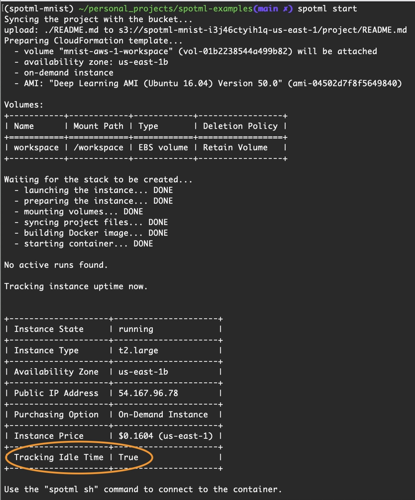
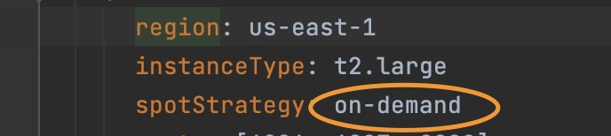
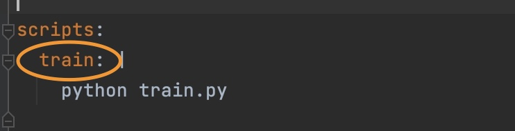
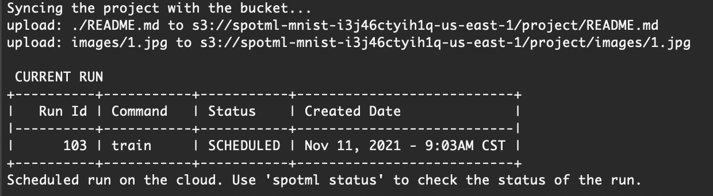
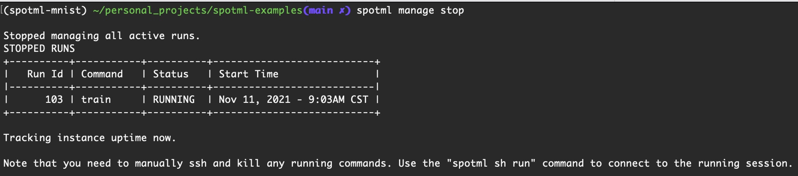
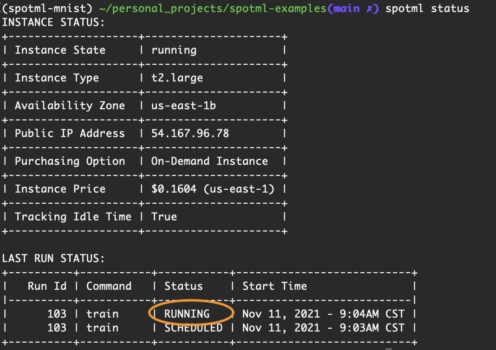
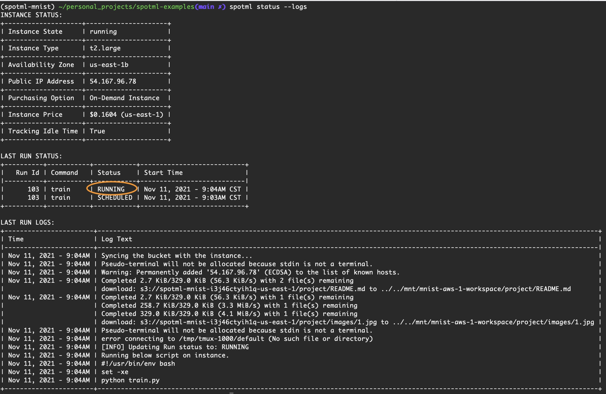
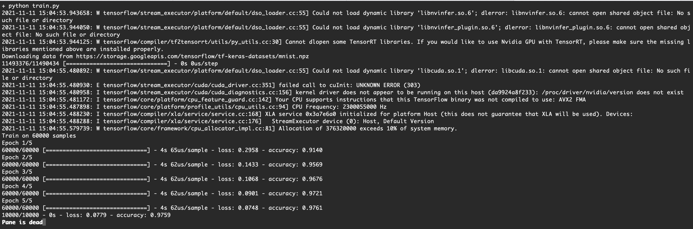

This example shows:
1. Simple Example: 
   * How to `start` an aws instance to train MNIST code.
   * How to `ssh` into instance to check progress.
   * How to `download` results to local machine


2. Managed Run Example: 
   * How to let SpotML automatically manage a long-running training on `spot` instances. 
   * SpotML automatically restarts the interrupted instances and resumes training.
   * SpotML automatically turns off idle instance.

## Simple Example: 
Tutorial time - 5 minutes

----------

#### 1. Clone the repo
```
git clone https://github.com/SpotML/spotml-examples.git 
cd spotml-examples/mnist
```

#### 2. Start the instance
```
spotml start
```
Wait for the instance to start, you will see an output like below once complete.



By default, SpotML will track the instance for idle time. If the instance is idle for more than 30 mins, it's automatically terminated.
#### 3. SSH into instance
```
spotml sh
```
SpotML uses [tmux](https://github.com/tmux/tmux/wiki) sessions.
So to exit the ssh session type `Ctrl + b`, then type `d` to disconnect from the session.


#### 4. Download the generated model file.
Make sure you have disconnected from the above ssh session. Once you have, from your local terminal type below command to download the generated model file. 
```
spotml download -i 'my_model.h5'
```

----------

## Managed Run Example: 
Tutorial time - 3 minutes

#### 1. Update config file
Open the spotml.yaml file and find the line that says


change it to 
```angular2html
spotStrategy: spot
```
Also notice the scripts section of config file like below. This allows you to configure keywords like `train` to run  your custom training command.



#### 2. Run the script
```
spotml run train
```
This should produce output like below. If the instance is not already running, 
spotML tries to spawn a new spot instance and runs the above script 
once the instance is ready.



Note that if a spot instance is not available, spotML backend service keeps 
trying every 15 mins, until it can spawn the instance.
So you can turn off your laptop and do other things, while SpotML tries to 
schedule the run. 

If you intend to cancel the scheduled run, type 
```
spotml run stop
```
 

#### 3. Check Status
```
spotml status
```
You can check the status of the `instance`, and the `run` with the above command.
Once the instance is running you should see an output like below. 



To also check any logs generated when starting the instance type  
```angular2html
spotml status --logs
```


Once you see the run status as `RUNNING` from the `status` command you can ssh into the actual run session by typing
```angular2html
spotml sh run
```
This opens the tmux session where spotML ran the `train` command. 


You can also just ssh into a separate normal ssh
session by typing `spotml sh` as before for an interactive
session.